# SpecPine — Theme Image Set

WarGames-style CRT promo art for the SpecPine Pager app. Mirrors BluePine's
`images/` convention: README/marketing images only — these are **not**
displayed by the Pager itself. The on-device equivalents are
`payloads/specpine/data/specpine_logo.txt` (LOG ASCII), `data/ansi/*.txt`
(per-feature LOG frames), and `bin/specpine_splash.py` (`/dev/fb0` boot
animation).

Regenerate everything in this folder with:

```bash
python3 scripts/generate_theme_images.py
```

(Requires Pillow: `python3 -m pip install --user --break-system-packages Pillow`.)

## Index

| Image | Purpose |
|---|---|
| 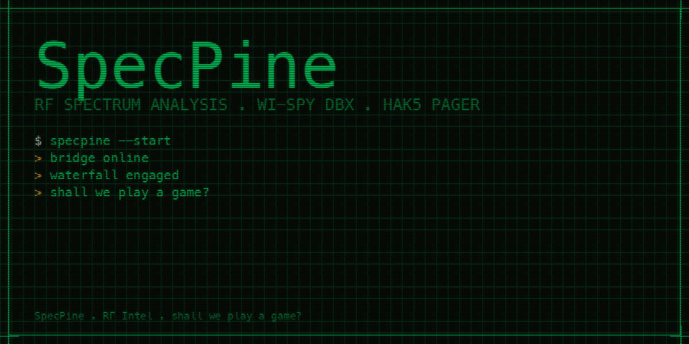 | Main poster — green-on-black phosphor |
| 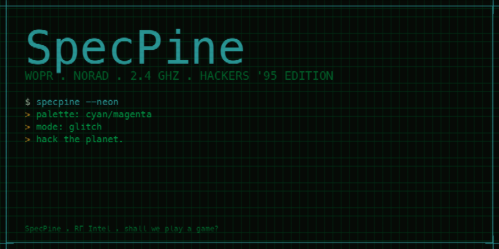 | Hackers '95 cyan/magenta variant |
| 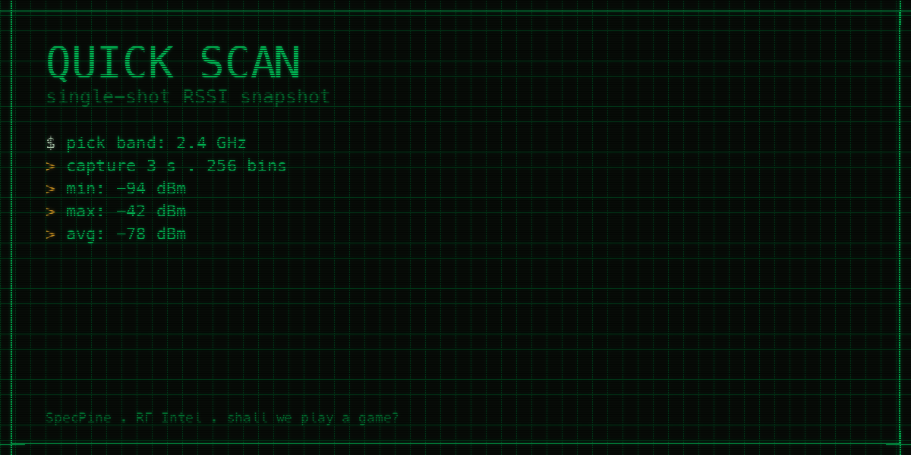 | Quick Scan feature card |
| 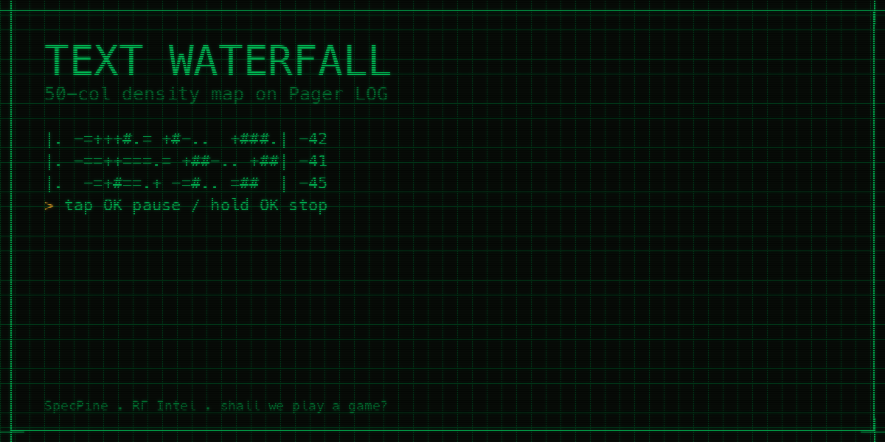 | Text Waterfall feature card |
| 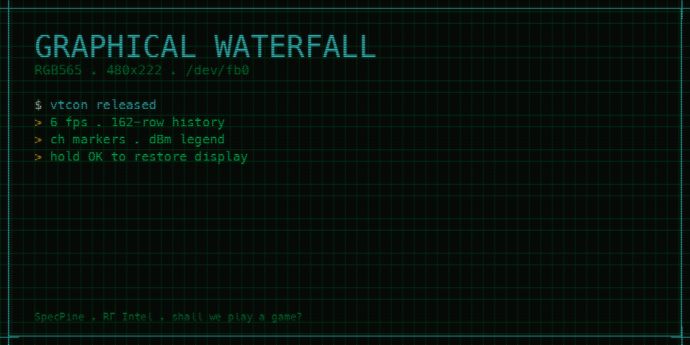 | Graphical Waterfall feature card |
| 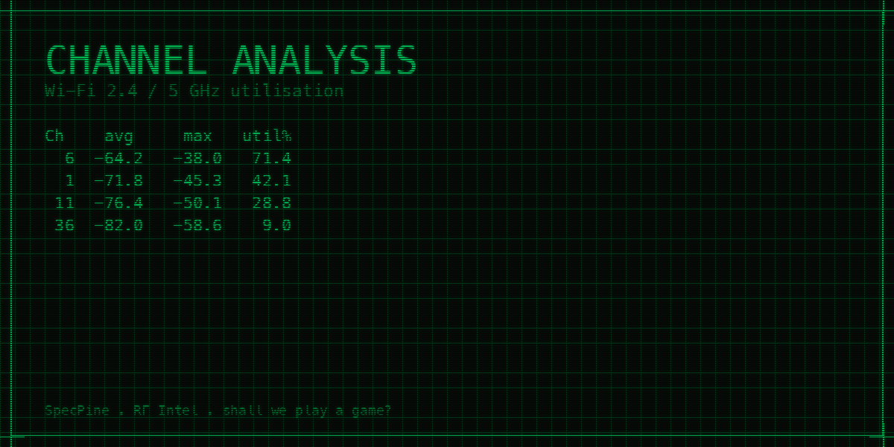 | Channel Analysis feature card |
| 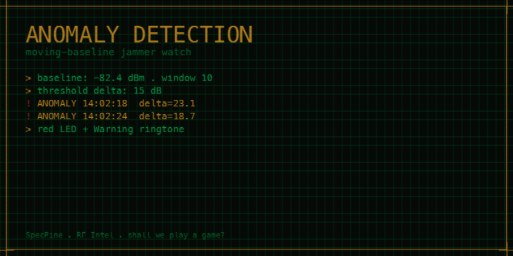 | Anomaly / Jammer Detection feature card |
| 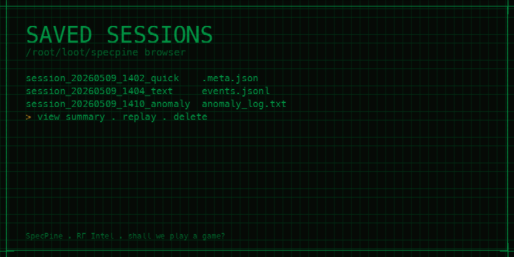 | Saved Sessions browser card |
| 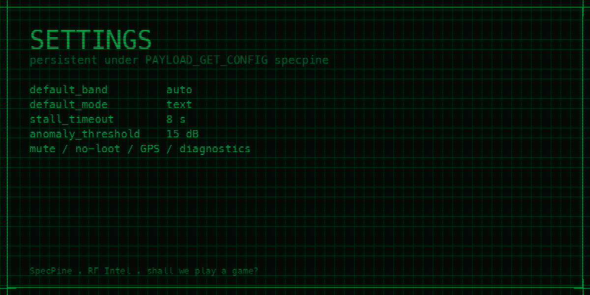 | Settings card |
| 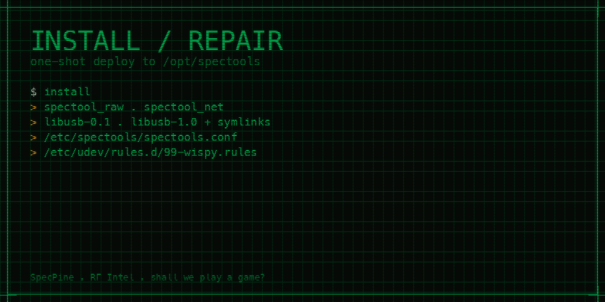 | Install / Repair card |
| 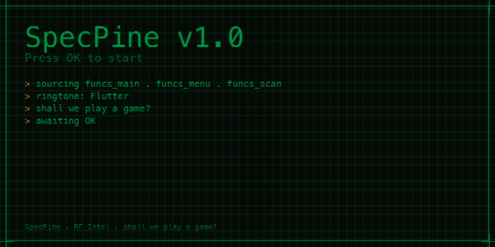 | Boot screen reproduction |

## Style guide

- Background: near-black (`#080c08`) with a faint `#1c3826` 20-px grid
- Primary accent: phosphor green `#00dc64` (CRT)
- Secondary accent: cyan `#3cdcdc` (Hackers '95 / WOPR variant)
- Highlight: amber `#ffb428` (anomaly/warning)
- Title font: any system monospaced (Menlo / DejaVu Sans Mono / Liberation Mono)
- Effects: 3-px scanlines, gentle Gaussian-blur "phosphor glow"
- Frame: 14-px outer border with corner notches in the accent colour
- Body lines use prompt prefixes:
  - `$ ` (white) — user input
  - `> ` (amber → green) — output
  - `! ` (red → green) — alert / anomaly

## Authoring new cards

The generator's `render_card(out_path, title, body_lines, …)` helper accepts:

```python
render_card(
    OUT_DIR / "specpine-newthing.png",
    title="NEW THING",
    sub_title="one-line description",
    body_lines=[
        "$ command",
        "> output",
        "! alert",
        "plain line",
    ],
    accent=GREEN,             # or CYAN, AMBER
    size=(1200, 600),
    title_size=56,
)
```

Add the call to `render_all()` in `scripts/generate_theme_images.py`.
